# linux-lab4

Добавим новые диски:


## 1. Cобрать R0/R5/R10 на выбор
Теперь установим необходимую утилиту ```sudo yum install mdadm```. Был выбран R10 массив, потому что в таком массиве сохраняется скорость R0 при надёжности R1, а недостатком высокой цены массива в рамках лабораторной можно пренебречь. поэтому были добавлены 4 диска - основное требование для этого массива - чётное количество дисков не менее четырёх. Используем команду ```sudo mdadm --create /dev/md0 -l 10 -n 4 /dev/sd{b..e}``` для сборки массива.


Проверим корректность с помощью ```mdadm --detail /dev/md0```:

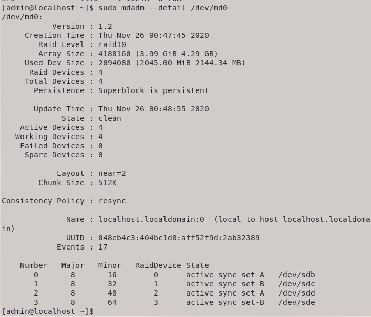

## 2. Сломать и починить RAID;

Поскольку все диски виртуальные, то "выдернуть" один из них физически нет возможности, поэтому просто отключим его поставив метку fail и извлечём. для этого используем команды ```sudo mdadm /dev/md0 --fail /dev/sdd``` и ```sudo mdadm /dev/md0 --remove /dev/sdd```. При проверке статуса "скоррапченый" диск отображается как извлечённый:

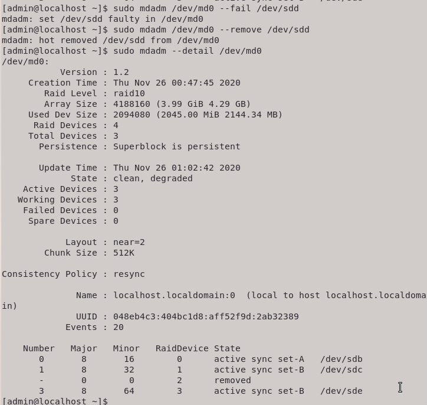

Заменим его неповреждённым диском командой sudo mdadm --add /dev/md0 /dev/sdf. Если у вас быстрые пальцы (или медленный ноутбук) то командой mdadm --detail /dev/md0 можно поймать момент когда диск в процессе монтирования в систему:

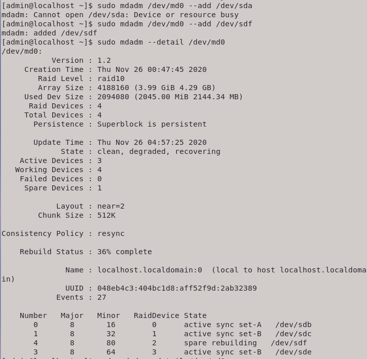

После диски синхронизируются и система снова готова к полноценной работе:

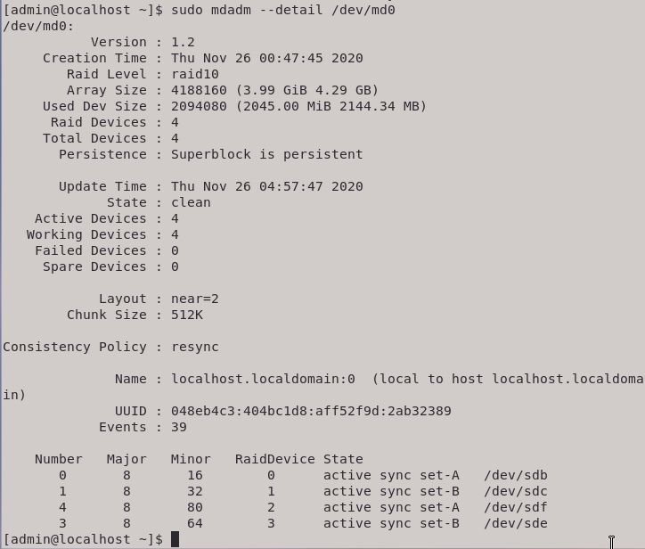

Если мы вернём в систему починенный диск d - sudo mdadm --add /dev/md0 /dev/sdd - то он будет помечен как запасной (spare), потому что у него нет пары и нарушится чётность:

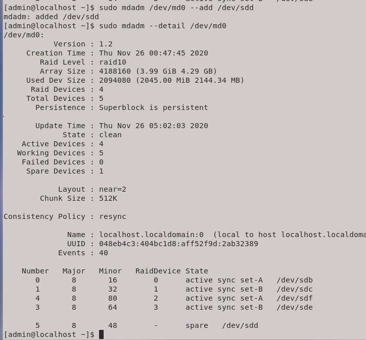

## 3. Проверить, что рейд собирается при перезагрузке;

Для этого создадим конфигурационный файл последовательностью команд (может потребоваться перход в root пользователя):

```bash
mkdir /etc/mdadm
echo "DEVICE partitions" > /etc/mdadm/mdadm.conf
mdadm --detail --scan --verbose | awk '/ARRAY/ {print}' >> /etc/mdadm/mdadm.conf
```

В результате будет сгенерирован конфигурационный файл следующего вида:

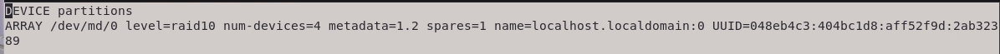

После чего выполняем команды ```sudo mdadm --stop /dev/md0``` и ```sudo mdadm --assemble /dev/md0``` для остановки и перезапуска массива соответственно:

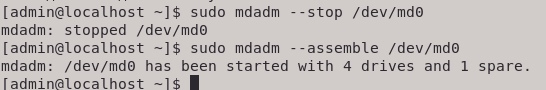

Далее выполняем перезагрузку и проверяем. Массив корректно собирается:

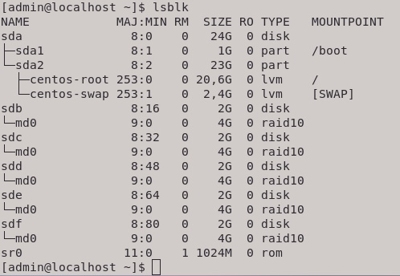

## 4. Cоздать на созданном RAID-устройстве раздел и файловую систему;

Для добавления раздела воспользуемся командой ```sudo fdisk /dev/md0```. После выбираем команды n - новый раздел, p - тип раздела основной, 1 или ENTER - номер раздела, указываем размер раздела (в данном случае выбран христоматийный размер в 512Мб) - +512M:

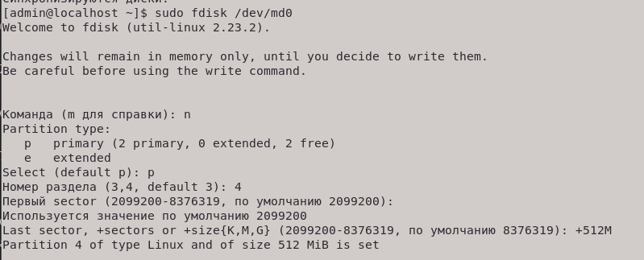

После чего сохраняем ключём w и выходим (u). Создадим файловую систему командой ```sudo mkfs.ext4 /dev/md0p1```. В результате получаем такой вид:

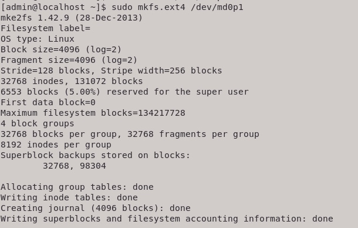

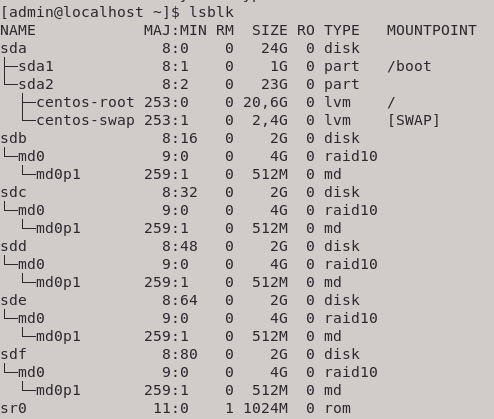

## 5. Добавить запись в fstab для автомонтирования при перезагрузке.

Сначала вводим команду ```sudo blkid /dev/md0p1``` чтобы узнать нужный UUID, после чего редактируем файл ```fstab``` - добавим туда строку ```UUID=24d17f2f-53d3-4f79-a047-2410aa8d13ed /mnt ext4 defaults 0 0```.

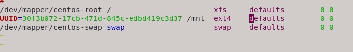

после чего выполняем команду mount -a.
