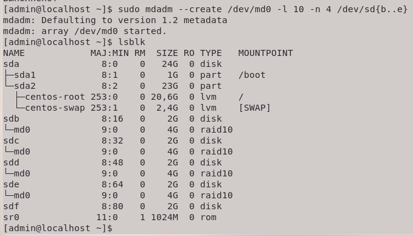

# linux-lab4

Добавим новые диски:


##1. Cобрать R0/R5/R10 на выбор
Теперь установим необходимую утилиту ```sudo yum install mdadm```. Был выбран R10 массив, потому что в таком массиве сохраняется скорость R0 при надёжности R1, а недостатком высокой цены массива в рамках лабораторной можно пренебречь. поэтому были добавлены 4 диска - основное требование для этого массива - чётное количество дисков не менее четырёх. Используем команду ```sudo mdadm --create /dev/md0 -l 10 -n 4 /dev/sd{b..e}``` для сборки массива.



Проверим корректность с помощью ```mdadm --detail /dev/md0```:


