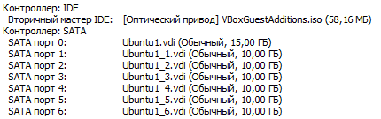

# linux-lab4

Добавим новые диски:



## 1. Cобрать R0/R5/R10 на выбор
Теперь установим необходимую утилиту ```sudo yum install mdadm```. Был выбран R10 массив, потому что в таком массиве сохраняется скорость R0 при надёжности R1, а недостатком высокой цены массива в рамках лабораторной можно пренебречь. поэтому были добавлены 4 диска - основное требование для этого массива - чётное количество дисков не менее четырёх. Используем команду ```sudo mdadm --create /dev/md0 -l 10 -n 4 /dev/sd{b..e}``` для сборки массива.


Проверим корректность с помощью ```mdadm --detail /dev/md0```:


## 2. Сломать и починить RAID;

Поскольку все диски виртуальные, то "выдернуть" один из них физически нет возможности, поэтому просто отключим его поставив метку fail и извлечём. для этого используем команды ```sudo mdadm /dev/md0 --fail /dev/sdd``` и ```sudo mdadm /dev/md0 --remove /dev/sdd```. При проверке статуса "скоррапченый" диск отображается как извлечённый:


Заменим его неповреждённым диском командой sudo mdadm --add /dev/md0 /dev/sdf. Если у вас быстрые пальцы (или медленный ноутбук) то командой mdadm --detail /dev/md0 можно поймать момент когда диск в процессе монтирования в систему:


После диски синхронизируются и система снова готова к полноценной работе:


Если мы вернём в систему починенный диск d - sudo mdadm --add /dev/md0 /dev/sdd - то он будет помечен как запасной (spare), потому что у него нет пары и нарушится чётность:
